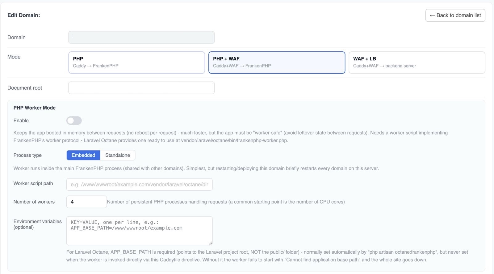
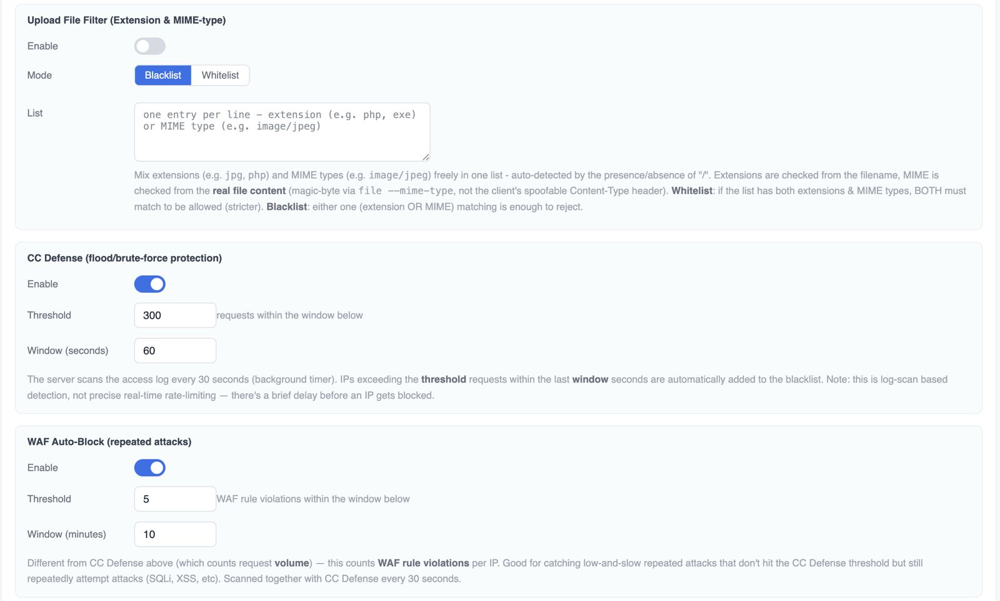
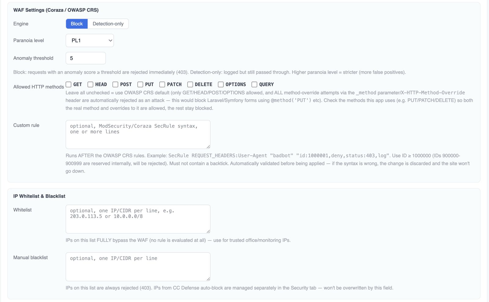
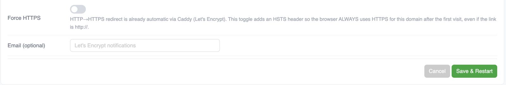

# aaPanel FrankenPHP Manager

An [aaPanel](https://www.aapanel.com/) plugin to install and manage [FrankenPHP](https://frankenphp.dev/) (a Caddy-based PHP application server) as a standalone service, independent from aaPanel's built-in Nginx-managed websites.

Available in **English** and **Bahasa Indonesia** (switch anytime from the language picker in the top-right of the plugin UI — applies server-wide, to every user).

## Screenshots

The Add/Edit Domain form (scrolled top to bottom):



*Mode picker and PHP Worker Mode — choose Embedded (runs inside the shared FrankenPHP process) or Standalone (its own systemd-managed process, reverse-proxied), point it at a worker script, and set any environment variables it needs (e.g. Laravel Octane's `APP_BASE_PATH`).*



*Upload File Filter (by extension and/or real file content, not just the spoofable `Content-Type` header), CC Defense (blocks IPs exceeding a request-volume threshold), and WAF Auto-Block (blocks IPs with repeated WAF rule violations — catches low-and-slow attacks CC Defense would miss).*



*Core Coraza/OWASP CRS settings — block vs detection-only, paranoia level, allowed HTTP methods (with safe handling of framework method-override), custom rules, and IP whitelist/blacklist.*



*Force HTTPS (adds an HSTS header on top of Caddy's already-automatic HTTP→HTTPS redirect) and an optional Let's Encrypt notification email.*

## Features

### Install

- **Official release** — download a prebuilt FrankenPHP binary (choose PHP `latest` / `8.4` / `8.3`). Fastest option, ready in seconds.
- **Build from source** — compile PHP + FrankenPHP yourself via [static-php-cli](https://github.com/crazywhalecc/static-php-cli), picking any PHP version and any combination of ~115 extensions (e.g. `swoole`, `pgsql`, `redis`, `imagick`...) not available in the official release. Takes 15–40+ minutes depending on CPU.
  - Optional **GitHub token** field — the build fetches source from `api.github.com` dozens of times; without a token you're limited to 60 requests/hour per IP (easy to hit and fail with a 403), a token raises that to 5000/hour. Stored server-side, write-only (never echoed back to the UI).
  - The extension list is refreshable from a specific `static-php-cli` release tag if upstream adds new extensions later.
- Install/uninstall run as a background task via aaPanel's own task queue — safe to close the browser tab, progress also shows in aaPanel's native Task message box (not just this plugin's own UI).
- **Uninstall** (Settings → Danger Zone) — fully removes the FrankenPHP service, binary, and all domain/WAF/worker configuration from the server. Project files in each domain's document root are **not** touched.

### Multi-domain management

Add/edit/remove domains, each running in one of three modes:

- **`PHP`** — plain Caddy → FrankenPHP
- **`PHP + WAF`** — Caddy + Coraza WAF → FrankenPHP
- **`WAF + Load Balancer`** — Caddy + Coraza WAF → one or more backend servers, with health checks

The domain field also accepts a plain **IPv4 address** if you don't have a domain pointed at the server yet — HTTPS then uses a self-signed certificate (Caddy's internal CA) since Let's Encrypt can't issue certs for bare IPs. `Force HTTPS`/HSTS is disabled for IP-based sites (combining HSTS with an untrusted cert can lock browsers out of the site for up to a year with no way to bypass it).

### WAF (Coraza / OWASP CRS)

Per domain, for `PHP + WAF` and `WAF + Load Balancer` modes:

- Block or detection-only mode, paranoia level, anomaly score threshold
- Custom ModSecurity/Coraza rules
- IP whitelist / blacklist (manual + automatic)
- Allowed HTTP methods allow-list (including safe handling of Laravel/Symfony-style `_method` override)
- File upload filter: allow/deny list by extension and/or real MIME type (magic-byte inspection via `@inspectFile`, not the spoofable client `Content-Type` header)
- CC Defense (request-flood protection) and WAF Auto-Block (repeated-violation IP auto-blacklisting)
- Force HTTPS (HSTS)

Blocked requests get a traceable reference ID in the `403` response body (`[ref:...]`), correlated 1:1 with Coraza's internal transaction ID for support/log lookup — searchable in the WAF event log (see Observability below).

### PHP Worker Mode

Keeps the application booted in memory between requests instead of rebooting the whole framework on every request (Laravel Octane-style) — pick per domain:

- **Embedded** — the worker runs inside the main shared FrankenPHP process. Simplest, no extra process, but restarting/deploying this domain briefly restarts *every* domain sharing that process.
- **Standalone** — the worker runs as its own `frankenphp php-server --worker=...` process, on an auto-allocated local port (9100–9999, persisted across saves), managed by its own systemd unit (`Restart=always`, enabled on boot — no supervisord needed). The domain is reverse-proxied to it. Restarting/deploying this domain does **not** affect any other domain.

Both need a worker script implementing FrankenPHP's [worker protocol](https://frankenphp.dev/docs/worker/) (e.g. Laravel Octane ships one at `vendor/laravel/octane/bin/frankenphp-worker.php`), plus any environment variables it needs (`KEY=VALUE`, one per line). **Laravel Octane specifically requires `APP_BASE_PATH`** pointing at the Laravel project root (not the `public/` folder) — normally set automatically by `php artisan octane:frankenphp`, but never set when the worker is invoked directly through this plugin's Caddyfile/systemd integration, so it must be entered manually here.

> Benchmarked on a small single-core-per-request VM: worker mode's advantage only shows up on *heavy* routes (many DB queries) under concurrent load — for lightweight routes (redirects, static pages) classic mode performs the same or better, and standalone specifically has a small added-latency cost from its extra reverse-proxy hop. Test your own workload before committing to a mode.

### PHP configuration & CLI

- Tune the FrankenPHP-embedded PHP runtime (memory limit, upload size, `display_errors`, timezone, etc.) from the UI.
- Optional system-wide PHP CLI wrapper (`/usr/bin/php`) so `composer`/`artisan` use FrankenPHP's PHP build.

### Observability

- Overview dashboard, per-domain traffic stats, attack map by country (GeoIP, DB-IP data), request log.
- Searchable/paginated WAF event log — filter by IP, time range, or the block reference ID mentioned above.

## Installation

Copy this directory to `/www/server/panel/plugin/frankenphp/` on your aaPanel server, then restart the aaPanel service so it picks up the new plugin. Open it from the aaPanel plugin list and click **Install FrankenPHP**.

### Deploy via git

**First install** (directory doesn't exist yet) — clone straight into the `frankenphp` plugin slot:

```bash
cd /www/server/panel/plugin/
git clone https://github.com/galihlasahido/aapanel-frankenphp-manager.git frankenphp
```

**Update an existing install** (already cloned as above) — pull from inside the plugin directory itself:

```bash
cd /www/server/panel/plugin/frankenphp/
git pull
```

Then restart the aaPanel service so it reloads the plugin code. Restarting the panel does **not** touch an already-running FrankenPHP service or any of its domains — plugin code updates and the running FrankenPHP process are independent.

> Note: `git pull <url> <branch>` only works from *inside* an already-initialized repo, and the branch here is `main` (not `frankenphp`) — use `git clone ... frankenphp` for a first-time deploy into a folder named `frankenphp`.

## Quick start

1. **Install** — pick the official release for the fastest setup, or build from source if you need an extension not in the official build (set a GitHub token first if building from source).
2. **Add a domain** — Domains tab → *Add Domain*. Pick a mode (start with `PHP`, or `PHP + WAF` if you want Coraza protection from day one). Point DNS at the server first for automatic HTTPS to succeed (or use an IP address for a quick self-signed-HTTPS test without DNS).
3. *(Optional)* **Enable Worker Mode** on that same domain if it's a Laravel/Octane-style app and you want persistent-process performance — fill in the worker script path, worker count, and `APP_BASE_PATH` env var.
4. *(Optional)* Tune **WAF** settings on the Security tab, watch the WAF event log fill in as traffic hits the site.
5. *(Optional)* Set up the **PHP CLI wrapper** under Settings if you'll be running `composer`/`artisan` commands against this PHP build from the shell.

## Troubleshooting

- **Custom build fails with GitHub 403 / rate-limit errors** — set a GitHub token (Install screen → GitHub Token field, or Settings once installed) and retry.
- **`coraza_waf is not a registered directive` when saving a WAF-mode domain** — only affects custom builds made before this was fixed; reinstall (uninstall then build again) to pick up the fix.
- **Two installs running at once** — the installer takes an exclusive lock; a second concurrent install attempt fails fast with a clear message instead of corrupting the first one's files.

## License

No license specified yet.
